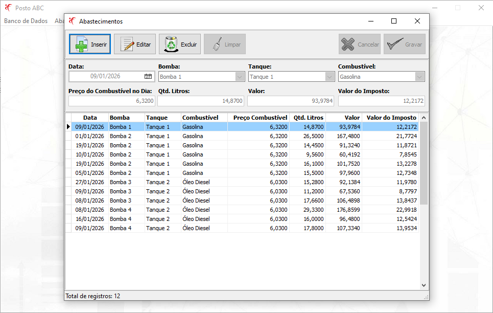
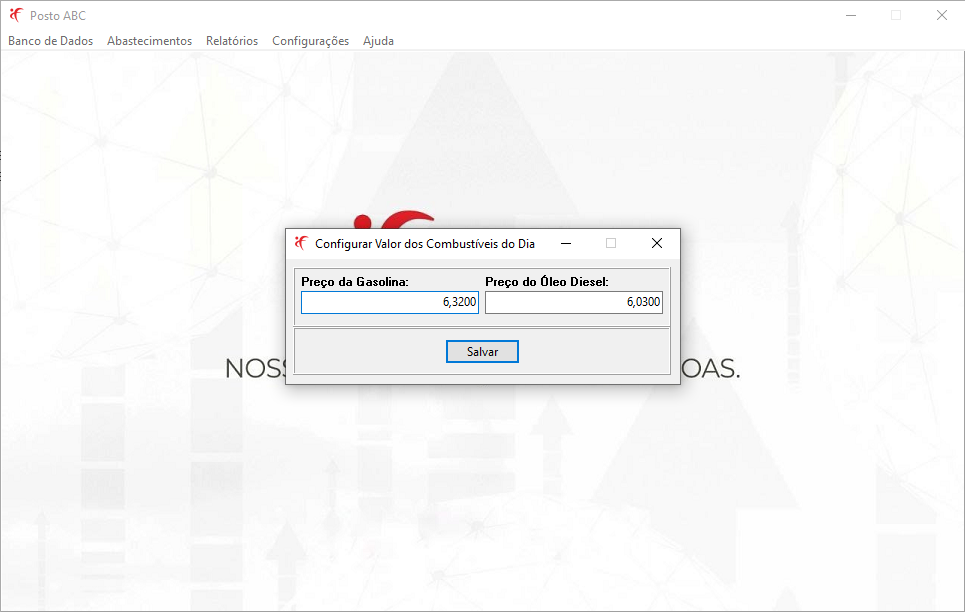
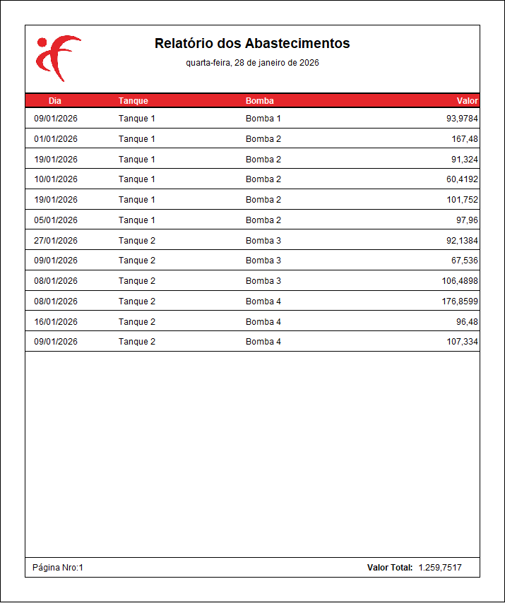

<h1 align="center">    
    
Projeto Posto ABC

        
	      
    		
	  
    
	      
    
</h1>

## Índice
- [Sobre](#-sobre)
- [Feramentas](#-ferramentas)
- [Funcionalidades](#-funcionalidades)
- [Licença](#-licença)

## 📘 Sobre

**Teste prático para Analista Desenvolvedor Delphi**, sistema para gerenciar os abastecimentos e tanques de combustíveis do posto ABC.

**Tempo total de desenvolvimento do projeto:** 8 horas.

## 🛠 Ferramentas

- [Delphi 12](https://www.embarcadero.com/br/)
- [Delphi Horse](https://github.com/HashLoad/horse)
- [FortesReport](https://github.com/fortesinformatica/fortesreport-ce)
- [Firebird](https://www.firebirdsql.org/)
- [Git](https://git-scm.com/)
- [Horse](https://github.com/HashLoad/horse)
- [Tortoise Git](https://tortoisegit.org/)

## 💡 Funcionalidades

- **Banco de Dados/Configurar...**: Abre a tela de configuração do arquivo **postoabc_config.ini**. Esse arquivo deve ficar na pasta **Config** na raíz do programa.

- **Abastecimentos**: Tela para cadastro dos **abastecimentos** feito no dia.

- **Relatórios**: Tela para imprimir os **abastecimentos** realizados de acordo com o período selecionado.

- **Configurações**: Tela para configurar o **valor dos combustíveis**. Uma vez configurado, na tela de cadastro dos abastecimentos o campo **Preço do Combustível no dia** é preenchido automaticamente.

## 📄 Licença

Esse software é **free** e foi construído para realizar o **Teste prático para Analista Desenvolvedor Delphi**.
